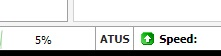

   
  

<h2 align="center">ATUS ruTorrent API plugin</h2>

ruTorrent plugin to interact with [ATUS](https://github.com/SteffenLoges/atus).

## Installation

copy the `atus` folder to your `plugins` folder (usually `/var/www/rutorrent/plugins/`)

After that, reload the ruTorrent webinterface. The text `ATUS` should appear in the info bar in the bottom left.

## License

[MIT](https://choosealicense.com/licenses/mit/)
